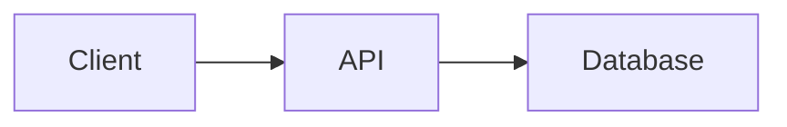

# Diagrams

Use this reference before adding or changing a Mermaid diagram, map, 3D model, or static diagram asset.

## Decide whether a diagram helps

Default to prose, a list, or a table. Add a diagram when it makes an important relationship materially faster or less error-prone to understand, such as:

- A workflow with several dependent steps, branches, loops, or state transitions.
- Interactions whose order across several actors or systems matters.
- Architecture boundaries, dependencies, trust zones, ownership, or data and control flows.
- A hierarchy, network, entity relationship, or deployment topology with several meaningful connections.
- Geographic or three-dimensional information whose spatial structure is essential.

Do not add a diagram for a single fact, a short linear procedure, a small comparison, decoration, or information that is clearer as literal text, code, logs, or a table. Avoid diagrams that will become stale faster than the surrounding documentation or that require more effort to decode than the relationship they explain.

A diagram supports the documentation; it does not replace it. Introduce the diagram with a complete sentence, then explain its important relationships, sequence, or conclusion in adjacent text. Preserve literal component names, and label proposed or target architecture separately from implemented behavior.

## Choose the format

Choose the smallest format that expresses the relationship readers need:

| Need | Preferred format |
| --- | --- |
| Process, decision, dependency, or topology | Mermaid flowchart |
| Time-ordered interactions among actors | Mermaid sequence diagram |
| Lifecycle and allowed transitions | Mermaid state diagram |
| Entities, classes, or data relationships | Mermaid entity-relationship or class diagram |
| Chronology or schedule | Mermaid timeline or Gantt chart, when dates come from an authoritative source |
| Geographic points, paths, or boundaries | GeoJSON or TopoJSON when every target renderer supports it |
| Three-dimensional shape | ASCII STL when every target renderer supports it |
| Precise visual layout or unsupported renderer | SVG when practical, otherwise PNG |

Use a table when readers need exact comparison across consistent attributes. Use prose or a list when sequence and relationships remain clear without a visual.

Prefer text-based diagram source when it is supported because reviewers can inspect changes and maintainers can update labels without recreating an image. Use a static asset when the renderer lacks the required syntax, exact placement is essential, or a generated diagram must remain visually identical across destinations.

## Match the renderer

Identify every authoring and rendering destination as described in [Markdown variants](markdown-variants.md).

GitHub renders four diagram syntaxes in fenced blocks: `mermaid`, `geojson`, `topojson`, and `stl`. Use Mermaid for general technical diagrams, GeoJSON or TopoJSON only for geographic data, and ASCII STL only for a meaningful 3D model. Check GitHub's active Mermaid version before using recently introduced syntax.

Obsidian renders Mermaid code blocks natively. Obsidian-specific Mermaid classes can create internal links, but those links are not portable and do not create Graph view relationships. Preserve them only when the vault intentionally uses that behavior.

For a document that must render in both GitHub and Obsidian, prefer a Mermaid fence that both current renderers support:

````markdown

````

Renderer Mermaid versions can differ. Preview the diagram in every required destination and use the oldest shared syntax. Do not assume that GitHub's GeoJSON, TopoJSON, or STL rendering works in Obsidian or another documentation site. When required renderers do not share a diagram format, use an SVG or PNG plus the source used to generate it when practical.

## Keep diagrams accessible and maintainable

- Make each diagram answer one clear reader question. Split dense diagrams by concern or level of detail.
- Use concise, sentence-cased labels and the repository's exact terminology.
- Do not rely on color, position, line style, icon, animation, or interactivity as the only indication of meaning.
- Keep a text explanation adjacent to the diagram. For complex diagrams, describe the meaningful nodes and relationships rather than writing only a generic caption.
- Give static diagram assets concise alt text and provide a longer adjacent explanation when the relationships do not fit in the alt text.
- Keep text, code, commands, and terminal output as selectable text rather than screenshots.
- Avoid personal data, secrets, private hostnames, or sensitive topology details that the surrounding documentation should not disclose.
- Store editable source with generated static assets when the repository can maintain both, and document the generation command.
- Update or remove a diagram when implementation changes make it inaccurate.

Render the final diagram rather than reviewing only its source. Check labels, edges, ordering, contrast, light and dark themes when relevant, small viewports, and the adjacent text equivalent.
