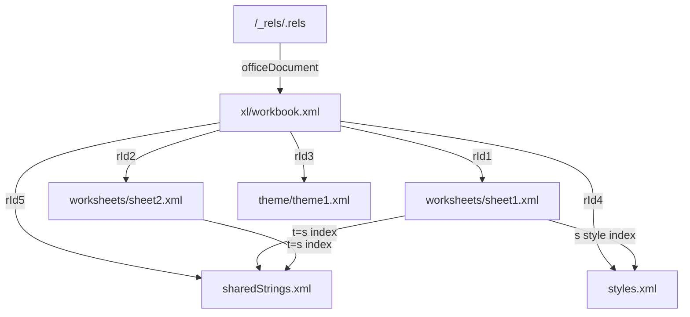
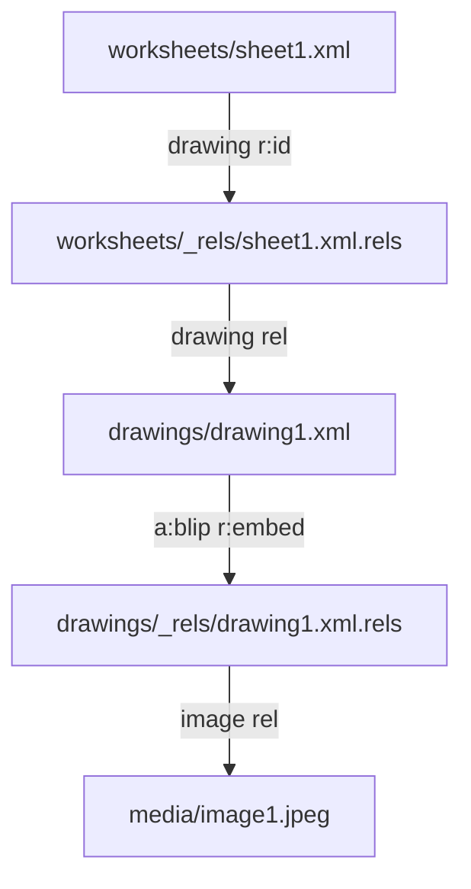

# How Excel stores an `.xlsx` file

An `.xlsx` file is not a single spreadsheet document. It is a **ZIP archive** of XML (and sometimes binary) parts that follow the **Open Packaging Conventions (OPC)**. Excel (and libraries like `xlsxedit`) open that ZIP, follow **relationships** between parts, and read SpreadsheetML XML.

Use [xlsx-inspect](https://github.com/jonas-kupferschmid/xlsx-inspect) to unpack a workbook and look at the same files this document describes.

---

## 1. Big picture

```text
report.xlsx  (ZIP)
├── [Content_Types].xml     ← what each part is
├── _rels/.rels             ← package root relationships
├── docProps/               ← title, author, app metadata
└── xl/
    ├── workbook.xml        ← sheet list (names + rIds)
    ├── _rels/workbook.xml.rels  ← workbook → sheets, styles, SST, …
    ├── worksheets/sheet1.xml
    ├── worksheets/sheet2.xml
    ├── sharedStrings.xml   ← string table (optional but common)
    ├── styles.xml          ← fonts / fills / cell formats
    ├── theme/theme1.xml    ← theme colors / fonts
    ├── drawings/drawing1.xml   ← floating images / chart frames
    ├── media/image1.jpeg       ← binary image bytes
    ├── charts/chart1.xml       ← chart definition (linked from drawing)
    ├── tables/table1.xml       ← Excel table metadata
    └── calcChain.xml           ← optional formula recalc order
```

Mental model:

| You think… | Excel stores… |
|------------|----------------|
| “Sheet1” tab | A name in `workbook.xml` + a link (`r:id`) to a worksheet part |
| Cell `A1` = `"hello"` | Usually: cell holds **index** `0`, and `sharedStrings.xml` entry `0` is `"hello"` |
| Bold cell | Cell attribute `s="1"` → style index in `styles.xml` |
| Number `42` | Written **inline** in the cell as `<v>42</v>` (no shared string) |
| Image on sheet | Worksheet `<drawing>` → `drawings/drawingN.xml` → `media/imageN.jpeg` |
| Chart on sheet | Drawing `graphicFrame` → `charts/chartN.xml` |
| Merged header | `mergeCells` block in worksheet XML (not inside the cell) |

Parts Excel does not need to rewrite (theme, unused styles, drawings you never touch) can stay byte-identical when a surgical library edits only cell text.

---

## 2. Package entry points

### `[Content_Types].xml`

Maps each package path to a MIME-like content type so consumers know how to interpret the part:

- Default: “all `.rels` files are relationships XML”
- Override: “`/xl/workbook.xml` is a spreadsheet workbook”, “`/xl/worksheets/sheet1.xml` is a worksheet”, etc.

Without this file, the package is incomplete.

### `_rels/.rels` (package relationships)

The **root** of the relationship graph. Typical entries:

| Id | Type (short) | Target |
|----|----------------|--------|
| `rId1` | `officeDocument` | `xl/workbook.xml` |
| `rId2` | core properties | `docProps/core.xml` |
| `rId3` | extended properties | `docProps/app.xml` |

To open a workbook: start at `_rels/.rels` → follow `officeDocument` → land on `xl/workbook.xml`.

Paths in relationship `Target` attributes are **relative to the source part** (here, relative to the package root).

---

## 3. Workbook ↔ sheets (relationships)

### `xl/workbook.xml`

Contains the visible sheet **names** and a relationship id for each sheet — not the sheet XML itself:

```xml
<sheets>
  <sheet name="Sheet1" sheetId="1" r:id="rId1"/>
  <sheet name="Sheet2" sheetId="2" r:id="rId2"/>
</sheets>
```

- `name` — tab label shown in Excel  
- `sheetId` — internal workbook id (stable-ish; not the file name)  
- `r:id` — key into the workbook’s `.rels` file  

### `xl/_rels/workbook.xml.rels`

Resolves those `r:id` values to files:

```xml
<Relationship Id="rId1" Type="…/worksheet" Target="worksheets/sheet1.xml"/>
<Relationship Id="rId2" Type="…/worksheet" Target="worksheets/sheet2.xml"/>
<Relationship Id="rId4" Type="…/styles" Target="styles.xml"/>
<Relationship Id="rId5" Type="…/sharedStrings" Target="sharedStrings.xml"/>
<Relationship Id="rId3" Type="…/theme" Target="theme/theme1.xml"/>
```

So the chain for Sheet1 is:

```text
workbook.xml  <sheet name="Sheet1" r:id="rId1"/>
       ↓
workbook.xml.rels  Id="rId1" → worksheets/sheet1.xml
```

**Important:** sheet **order** in the UI is the order of `<sheet>` elements in `workbook.xml`, not the numeric order of `sheet1.xml` / `sheet2.xml` file names. The file name is just a part path; the `r:id` is what matters.

The same `.rels` file also links **shared workbook-level** parts:

- styles → one `styles.xml` for the whole workbook  
- sharedStrings → one string table for the whole workbook  
- theme → theme colors/fonts  

Sheets do **not** each get their own copy of those.



---

## 4. Worksheet: sparse grid of cells

`xl/worksheets/sheetN.xml` holds one sheet’s cells. Excel only stores **used** cells — empty rows/columns are often omitted.

Typical structure:

```text
worksheet
├── dimension      ← used range hint (e.g. A1:C7)
├── sheetViews     ← zoom, active cell
├── sheetFormatPr  ← default row height, default column width
├── cols           ← per-column width overrides
├── sheetData      ← the cells (rows may have custom ht)
│   └── row r="4" ht="47" customHeight="1"
│       └── c r="A1" t="s" s="1"
│           └── v  … value or SST index
└── pageMargins / …
```

### Column width and row height

**Fixture:** `xlsx-inspect/output/CustomCellSize/`

Sizing lives in the **worksheet part**, not in `styles.xml`. It affects how Excel lays out the grid — and therefore how **images and charts appear**, even when `drawingN.xml` bytes are unchanged.

**Defaults** (`sheetFormatPr`):

```xml
<sheetFormatPr baseColWidth="10" defaultRowHeight="16" x14ac:dyDescent="0.2"/>
```

**Column override** — only column C widened in the fixture:

```xml
<cols>
  <col min="3" max="3" width="32" customWidth="1"/>
</cols>
```

| Attribute | Meaning |
|-----------|---------|
| `min` / `max` | Column range (1-based; 3 = column C) |
| `width` | Width in **character units** (width of the `0` glyph in the workbook font — not pixels, not EMU) |
| `customWidth="1"` | User explicitly set this width (vs Excel auto-fit) |

**Row override** — row 4 made taller:

```xml
<row r="4" spans="1:3" ht="47" customHeight="1" …>
```

| Attribute | Meaning |
|-----------|---------|
| `ht` | Row height in **points** (1/72 inch) |
| `customHeight="1"` | User explicitly set height (vs default 16 pt) |

Fixture layout:

| Cell | Label | Sizing |
|------|-------|--------|
| `A1` | this is a normal cell | default column A, default row 1 |
| `C1` | this is a wide column | column C `width="32"` |
| `A4` | this is a long row | row 4 `ht="47"` |
| `C4` | this is a wide and long cell | both |

**xlsxedit today:** `<cols>` and row `ht` round-trip semantically on save (verified on `CustomCellSize.xlsx`). No public API to read or set widths/heights yet.

### Cell element `<c>`

| Attribute | Meaning |
|-----------|---------|
| `r` | Address, e.g. `B7` |
| `t` | Type (see below). Omitted often means **number** |
| `s` | Style index into `styles.xml` `cellXfs` (optional) |

Children:

| Element | Meaning |
|---------|---------|
| `<v>` | Value: number text, SST index, bool, etc. |
| `<f>` | Formula (if present, this is a formula cell) |
| `<is>` | Inline string (when `t="inlineStr"`) |

### Cell types (`t`)

| `t` | Meaning | `<v>` / content |
|-----|---------|------------------|
| *(absent)* | Number | `<v>42</v>` or `<v>3.14</v>` |
| `s` | Shared string | `<v>` is a **0-based index** into `sharedStrings.xml` |
| `inlineStr` | Inline string | Text under `<is>`, not in SST |
| `b` | Boolean | `0` / `1` |
| `e` | Error | e.g. `#DIV/0!` |
| `str` | Formula string result | cached string in `<v>` |

Example from a real unpack (Sheet1 `A1` → first shared string):

```xml
<c r="A1" t="s">
  <v>0</v>
</c>
```

→ look up entry **0** in `sharedStrings.xml` → `"this is a1"`.

Empty cells are usually **missing**, not stored as empty tags. That is why “skipped” cells in the grid do not appear as blank `<c>` rows between `A1` and `A3`.

---

## 5. Shared strings (`sharedStrings.xml`)

Text is expensive and often repeated. Excel’s common pattern:

1. Put each unique string (or at least each string occurrence Excel chose to intern) in a global table.  
2. Cells store only a small integer index.

```xml
<sst count="11" uniqueCount="11">
  <si><t>this is a1</t></si>           <!-- index 0 -->
  <si><t>this is b1</t></si>           <!-- index 1 -->
  ...
</sst>
```

- `<si>` = string item  
- Index = **0-based position** of that `<si>` among siblings  
- `count` ≈ total string-cell references; `uniqueCount` ≈ number of `<si>` entries (Excel’s bookkeeping; do not invent values casually)

### Plain vs rich text

**Plain:**

```xml
<si><t>this is bold text</t></si>
```

Cell appearance (bold of the whole cell) still comes from the cell’s **`s` style index**, not from the string. The string can be plain while the cell is bold.

**Rich (mixed formatting inside one cell):**

```xml
<si>
  <r><t xml:space="preserve">only </t></r>
  <r>
    <rPr><b/>…</rPr>
    <t>this</t>
  </r>
  <r>
    <rPr>…</rPr>
    <t xml:space="preserve"> is bold</t>
  </r>
</si>
```

Here formatting lives in **runs** (`<r>` + `<rPr>`), analogous to Word runs. `xml:space="preserve"` keeps leading/trailing spaces.

### Why this matters for search/replace

Editing `"hello"` → `"hi"` is usually:

1. Find string cells (`t="s"`).  
2. Read index from `<v>`.  
3. Change the corresponding `<si>` text (or a single `<t>` inside a rich `<si>`).  
4. Leave the cell’s `t`, `v` index, and `s` style alone.

Do **not** rebuild `styles.xml` just to change text. Do **not** invent a new SST entry if mutating the existing `<si>` in place is enough (`xlsxedit` v1 does in-place edits).

Strings on Sheet1 and Sheet2 share the **same** table. Changing index `9` changes every cell that points at `9`, on every sheet.

---

## 6. Styles (`styles.xml`)

Styles are also indexed tables, similar to shared strings.

Rough pipeline:

```text
fonts[]  fills[]  borders[]  numFmts[]
            ↓
        cellXfs[]   ← list of format records
            ↓
   cell attribute s="N" points at cellXfs[N]
```

Example: whole-cell bold often means:

1. A second `<font>` with `<b/>` (font id `1`).  
2. A second `<xf>` in `cellXfs` with `fontId="1"`.  
3. Cell: `<c r="B7" s="1" t="s"><v>7</v></c>`.

Theme colors (`theme="1"`) resolve through `xl/theme/theme1.xml`, not through hard-coded RGB in every font.

Surgical text edits should **preserve** the `s` attribute on `<c>`. Dropping `s` is a common way libraries “lose formatting.”

---

## 7. What stays separate (and why)

| Concern | File | Linked how |
|---------|------|------------|
| Tab names / order | `workbook.xml` | — |
| Sheet grid | `worksheets/sheetN.xml` | `r:id` from workbook +.rels |
| Cell text (usual) | `sharedStrings.xml` | index in cell `<v>` |
| Cell / font format | `styles.xml` | `s` on `<c>` |
| Theme | `theme/theme1.xml` | workbook rel |
| Images / charts | `drawings/`, `media/`, `charts/` | worksheet `<drawing r:id>` |
| Tables | `tables/tableN.xml` | worksheet `<tablePart r:id>` |
| Metadata | `docProps/*` | package `.rels` |

Excel composes a cell you see as:

$$
\text{visible cell} \approx \text{address} + \text{value (or SST lookup)} + \text{style (cellXfs)} + \text{theme}
$$

---

## 9. How this maps to `xlsxedit`

| Library idea | OPC / SpreadsheetML reality |
|--------------|-----------------------------|
| Opaque parts | theme, media, tables, pivot caches, calcChain and other unregistered parts stay blobs |
| Live XML parts | workbook, worksheets, sharedStrings, styles, drawings and charts are parsed (drawings and charts on first use) and keep their bytes until edited; see [how-xlsxedit-works.md](how-xlsxedit-works.md) §3 |
| `replace(old, new)` | rewrites `<t>` inside SST / inline strings; keeps cell `s` and SST indices |
| `replace(…, value_type="number")` | whole-cell text → numeric `<v>`; keeps `s` |
| Preserve formatting | don’t strip `s`; don’t rewrite `styles.xml` for text-only changes |
| Planned: images | read/write `drawings/` + `media/` subgraph; `insert_image_at_placeholder` for placeholders |
| Planned: dates | decode serial via `numFmt` from cell `s` |

Office Open XML (`.xlsx`, `.docx`, etc.) shares the same OPC rules: ZIP archive, relationships, and live XML parts. SpreadsheetML is Excel’s sheet vocabulary on top of that package model.

**Inspect fixtures:** unpack any workbook with [xlsx-inspect](https://github.com/jonas-kupferschmid/xlsx-inspect/blob/main/unpack_xlsx.py) — see `xlsx-inspect/output/<name>/` for real XML examples cited in sections 10–18 below.

---

## 10. Number formats and dates

**Fixture:** `xlsx-inspect/output/DifferentCellTypes/`

What you see in Excel (currency, percent, date, scientific, …) is mostly **display formatting**, not a different cell storage type. The cell still stores a number in `<v>` unless it is a string (`t="s"`).

### Pipeline

```text
cell  s="5"  →  styles.xml cellXfs[5]  →  numFmtId
                                              ↓
                                    numFmts[] or built-in id
                                              ↓
                              Excel renders $100.00, 50%, 7 Aug 2025, …
```

From `DifferentCellTypes/xl/styles.xml`:

- Custom formats live in `<numFmts>` (ids ≥ 164): e.g. `numFmtId="164"` currency, `numFmtId="168"` long date
- Built-in ids are implicit: `9` = percent, `11` = scientific, `14` = short date, `44` = accounting, …
- Each `<xf>` in `cellXfs` points at `numFmtId`, `fontId`, `fillId`, `borderId`

Example row in the fixture (`DifferentCellTypes.xlsx`):

```xml
<!-- A5 = "date",     B5: short date -->
<c r="B5" s="5"><v>45876</v></c>   <!-- 7 August 2025  → displays 07.08.2025 -->

<!-- A6 = "long date", B6: long date -->
<c r="B6" s="6"><v>45890</v></c>   <!-- 21 August 2025 → displays Thursday, 21 August 2025 -->
```

| Cell | Serial | Style `s` | `numFmtId` | What Excel shows |
|------|--------|-----------|------------|------------------|
| `B5` | `45876` | `5` | `14` (built-in short date) | `07.08.2025` |
| `B6` | `45890` | `6` | `168` (custom long date in `numFmts`) | `Thursday, 21 August 2025` |

Same storage type (plain number in `<v>`), **different serials**, **different format strings** — not two different XML “date types.”

### Dates are serial numbers

Excel stores dates as a **day count** from epoch 1899-12-30 (`date1904` off). Fractional part = time of day.

$$\text{calendar date} = \text{1899-12-30} + \text{serial days}$$

- Serial `45876` → **7 August 2025** (short date in `B5`)
- Serial `45890` → **21 August 2025** (long date in `B6`)

There is no `t="date"` on the cell.

### SAR / xlsxedit

| Task | Approach |
|------|----------|
| Read date in Python | Read `<v>`, follow `s` → `numFmtId`, convert serial if format is date-like |
| Write date | Set serial in `<v>`, **preserve** `s` (or clone xf with date format) |
| SAR `{ship_date}` → date | `value_type="date"` whole-cell match; write serial, keep style |
| Don’t | Store `"07.08.2025"` as shared string if the template expects a real date cell |

---

## 11. Merged cells

**Fixture:** `xlsx-inspect/output/MergedCells/`

Merges are **not** a property of individual `<c>` elements. They are declared after `sheetData`:

```xml
<mergeCells count="5">
  <mergeCell ref="A1:C1"/>
  <mergeCell ref="B2:C2"/>
  <mergeCell ref="B4:C4"/>
  <mergeCell ref="A6:A8"/>
  <mergeCell ref="B6:C7"/>
</mergeCells>
```

Rules:

- Only the **top-left** cell of a range holds the displayed text
- Other cells in the range may be absent, or present with only `s` and no value
- Excel UI shows one merged block; the grid underneath is still sparse XML

### SAR / xlsxedit

- Preserve the entire `<mergeCells>` block on save
- When writing `ws["B1"].value`, detect if `B1` is inside a merge but not the anchor — block, warn, or redirect to anchor (e.g. `A1` for `A1:C1`)
- Text replace in the anchor cell is fine; creating new `<c>` nodes inside a merge range can break Excel’s layout

---

## 12. Formulas

**Fixture:** `xlsx-inspect/output/SimpleFormula/`

Formula cells have a `<f>` child (and usually a cached `<v>`):

```xml
<c r="C3">
  <f>A3*B3</f>
  <v>437</v>
</c>
```

### Shared formulas

Excel stores one master formula and followers that share an index `si`:

```xml
<!-- master -->
<c r="C4">
  <f t="shared" ref="C4:C7" si="0">A4*B4</f>
  <v>689430</v>
</c>
<!-- follower -->
<c r="C5">
  <f t="shared" si="0"/>
  <v>684</v>
</c>
```

### calcChain.xml

Optional part listing recalculation order (`SimpleFormula/xl/calcChain.xml`). Safe to keep as an **opaque blob** if you do not edit the formula graph.

When xlsxedit **removes** a formula (`Cell.value` overwrite, `clear`, `clear_range`, bulk write), it **drops** `xl/calcChain.xml` and its workbook relationship, as `insert_rows`, `insert_columns`, `copy_worksheet` and `remove_worksheet` do. Excel rebuilds the chain on open. Leaving a stale chain after removing `<f>` causes Excel's "We found a problem with some content..." repair.

### SAR / xlsxedit

- `replace()` **skips** cells with `<f>` — avoids corrupting formulas
- `cell.formula = "…"` must not strip `t="shared"` / `si` on neighboring cells
- Overwriting a shared-formula **master** with a plain value also strips `<f>` from same-`si` followers (avoids orphan shared cells)
- Overwriting, clearing or re-formulating the anchor of a multi-cell array or data-table formula raises `FormulaGroupError` ([features.md](features.md#exceptions))
- Changing source cells (A3, B3) updates what Excel shows after recalc; cached `<v>` may be stale until Excel opens the file

---

## 13. Conditional formatting

**Fixture:** `xlsx-inspect/output/ConditionalFormatting/`

Conditional formatting lives in **worksheet XML**, typically after `sheetData`. It is separate from `styles.xml` (though some rules reference `dxfId` for differential formats).

Examples in the fixture:

| Range | Type | Meaning |
|-------|------|---------|
| `A2:A7` | `colorScale` | Green–yellow–red gradient |
| `C2:C7` | `dataBar` | In-cell bar + `x14` extension in `extLst` |
| `E2:E7` | `cellIs` greaterThan 6 | Highlight cells > 6 |
| `G2:G7` | `duplicateValues` | Highlight duplicates |
| `I2:I7` | `colorScale` | Custom colour stops |

Modern Excel features often need **both** legacy `conditionalFormatting` and `extLst/x14:conditionalFormattings`. Drop either and Excel may repair or lose the rule.

### SAR / xlsxedit

- Preserve all `conditionalFormatting` and `extLst` siblings when editing cells
- Changing values in `A2:A7` is exactly what CF is for — rules should still apply after save
- No special SAR API needed; fidelity tests assert rule count unchanged after unrelated edits

---

## 14. Images and drawings

**Fixture:** `xlsx-inspect/output/images/`

**This is the key section for image search-and-replace.**

Images are **not stored in cells**. They float in a **drawing layer** linked from the worksheet.

### Relationship chain



Worksheet tail (image can exist even when `sheetData` is almost empty):

```xml
<drawing r:id="rId1"/>
```

`sheet1.xml.rels`:

```xml
<Relationship Id="rId1" Type="…/drawing" Target="../drawings/drawing1.xml"/>
```

`drawing1.xml.rels`:

```xml
<Relationship Id="rId1" Type="…/image" Target="../media/image1.jpeg"/>
```

`[Content_Types].xml` must declare image extensions:

```xml
<Default Extension="jpeg" ContentType="image/jpeg"/>
```

### Anchor geometry (`xdr:wsDr`)

Each image is an `xdr:twoCellAnchor` or `xdr:oneCellAnchor` in `drawingN.xml`.

**twoCellAnchor** (from `images.xlsx` sheet1) — size and position from two cell corners:

```xml
<xdr:twoCellAnchor editAs="oneCell">
  <xdr:from>
    <xdr:col>1</xdr:col>        <!-- 0-based → column B -->
    <xdr:colOff>0</xdr:colOff>  <!-- EMU offset within column -->
    <xdr:row>0</xdr:row>        <!-- 0-based → row 1 -->
    <xdr:rowOff>1</xdr:rowOff>
  </xdr:from>
  <xdr:to>
    <xdr:col>2</xdr:col>
    <xdr:colOff>454793</xdr:colOff>
    <xdr:row>8</xdr:row>
    <xdr:rowOff>86102</xdr:rowOff>
  </xdr:to>
  <xdr:pic>…</xdr:pic>
</xdr:twoCellAnchor>
```

| Field | Meaning |
|-------|---------|
| `col`, `row` | 0-based grid index (col 0 = A, row 0 = row 1) |
| `colOff`, `rowOff` | Offset within cell in **EMU** (English Metric Units); 914400 EMU = 1 inch |
| `to` | Opposite corner — defines bounding box with `from` |
| `editAs` | `oneCell` = move/size with top-left cell when rows/columns change |
| `a:ext cx, cy` | Explicit size in EMUs inside `spPr/xfrm` |

**oneCellAnchor** — top-left cell plus explicit width/height (`xdr:ext`).

### Picture payload

Inside `xdr:pic`:

| Element | Role |
|---------|------|
| `cNvPr/@name` | Picture name in Excel (“Picture 2”) — **useful for SAR lookup** |
| `cNvPr/@id` | Drawing object id (unique within drawing part) |
| `a:blip/@r:embed` | Relationship id → binary file in `xl/media/` |
| `a:stretch` | How image fills the box |

### Reading position and size (conceptual)

- **Anchor cell (top-left):** column letter from `from.col`, row = `from.row + 1`
- **Width / height:** derive from `to` minus `from` corners, or read `a:ext cx/cy`
- **Multiple images:** multiple anchors in one `drawing1.xml`, or one drawing part per sheet (`images.xlsx` has `drawing1` on sheet1, `drawing2` on sheet2)

### Image search-and-replace — template patterns

Excel has no built-in “replace this text with an image.” Templates use conventions:

| Pattern | Template design | SAR strategy |
|---------|-----------------|--------------|
| **A — Placeholder cell** | Cell contains `{logo}`; image placed near that cell | After locating placeholder cell, clear text and insert/update image anchored at that address |
| **B — Named picture** | Picture `name="{logo}"` in `cNvPr` | Find anchor by name; swap media bytes or `r:embed` target |
| **C — Anchor match** | Image already anchored at same cell as placeholder | Match `from.col/row` to placeholder coordinates |

### Planned xlsxedit API (Phase 5)

```python
# iterate images on a sheet
for pic in ws.images:
    pic.name           # "Picture 2"
    pic.anchor         # top-left "B1"
    pic.width_emu      # raw EMU
    pic.height_emu
    pic.media_path     # "xl/media/image1.jpeg"

# set geometry
pic.anchor = "E2"
pic.width = 200   # pixels helper → EMU internally
pic.height = 150

# swap file bytes
pic.replace("new-logo.png")

# SAR: text placeholder → image
wb.insert_image_at_placeholder("{logo}", "logo.png")
```

### Surgical rules for images

1. **Never** put image bytes in `sharedStrings` or cell `<v>`
2. Swapping an image = replace `xl/media/imageN.*` **or** add new media part + update `blip@r:embed`
3. Moving/resizing = edit `from`/`to`/`ext` only — leave unrelated anchors intact
4. Adding an image = clone subgraph from a template (`images.xlsx`): media part + drawing part + sheet rel + `<drawing>` + content type default
5. Keep drawing/chart parts **byte-identical** when doing unrelated text SAR (already true today for opaque round-trip)

### How column/row sizing affects images and charts

Drawings anchor to the **grid**, not to cell text. Anchor EMU offsets in `drawingN.xml` are fixed in the file, but Excel computes the **on-screen box** from:

```text
column widths  +  row heights  +  from/to cell indices  +  colOff/rowOff (EMU)
```

So if you widen column C in `CustomCellSize` or a template:

- **`twoCellAnchor` (most images and charts):** the object **stretches** with the cells between `from` and `to`. Wider/taller cells → larger displayed image/chart box. The drawing XML does not need to change; Excel recalculates layout on render.
- **`editAs="oneCell"`** (e.g. `images.xlsx` sheet1): top-left corner moves with the anchor cell when rows/columns are inserted; width/height still depend on distance to `to` corner.
- **`oneCellAnchor`:** position from one cell + explicit `cx`/`cy` size — less sensitive to distant column widths.

**Implications for xlsxedit / image SAR:**

| Action | Risk if mishandled |
|--------|-------------------|
| Text SAR only | Low — preserve `<cols>` and row `ht` siblings; drawing bytes unchanged ✓ |
| Change column width in code | Image/chart **visual size shifts** unless you also adjust `to`/`from` or `a:ext` |
| Place image at `{logo}` in column C | Must respect column C `width` when computing anchor EMUs |
| Insert rows/columns | Anchors with `editAs="oneCell"` move; `twoCell` anchors may need recalculation |

**Recommended:** add a combined fixture later (`CustomCellSize` + image on wide column C) to test image SAR after column resize. For now, fidelity test `CustomCellSize.xlsx` for `<cols>` + `ht` preservation.

---

## 15. Charts

**Fixture:** `xlsx-inspect/output/ChartsAndTables/`

Charts use the **same drawing layer** as images, but the anchor contains a `graphicFrame` instead of `pic`:

```xml
<xdr:graphicFrame>
  <xdr:nvGraphicFramePr>
    <xdr:cNvPr name="Chart 5"/>
  </xdr:nvGraphicFramePr>
  <a:graphic>
    <a:graphicData uri="http://schemas.openxmlformats.org/drawingml/2006/chart">
      <c:chart r:id="rId1"/>
    </a:graphicData>
  </a:graphic>
</xdr:graphicFrame>
```

### Parts involved

```text
worksheet  →  drawing1.xml  →  chart1.xml
                           →  style1.xml, colors1.xml (optional, Excel 2013+)
workbook.xml  →  definedNames _xlchart.v1.*  (hidden chart helper names)
```

Chart **data** is cell references inside `chart1.xml` series:

```xml
<c:f>'bar chart'!$B$2</c:f>
```

Changing those source cells via SAR updates what the chart reads; Excel recalculates on open.

### SAR / xlsxedit

- Treat `charts/`, `drawings/`, chart styles as **opaque** for text SAR
- Fidelity test: after `replace` on a label cell, `chart1.xml` bytes unchanged
- Editing chart title or series ranges is Phase 6 — separate from image SAR

---

## 16. Excel tables

**Fixture:** `xlsx-inspect/output/ChartsAndTables/` — sheet “Table”, part `xl/tables/table1.xml`

```xml
<table name="Table2" displayName="Table2" ref="A1:C11" totalsRowShown="0">
  <autoFilter ref="A1:C11"/>
  <tableColumns count="3">
    <tableColumn name="Item"/>
    <tableColumn name="Price"/>
    <tableColumn name="Quantity"/>
  </tableColumns>
  <tableStyleInfo name="TableStyleMedium2" showRowStripes="1"/>
</table>
```

Linked from worksheet via `<tableParts count="1"><tablePart r:id="rId1"/></tableParts>` and sheet `.rels`.

Tables overlay formatting and filters on a cell range. The cell values still live in `sheetData` / SST as usual.

### SAR / xlsxedit

- Preserve `table1.xml` and `tableParts` on save
- Replacing text inside the table range is fine
- Expanding/shrinking `ref` when adding rows is Phase 6

---

## 17. Master feature map

| Feature | Primary part(s) | How sheet links | Inspect fixture |
|---------|-----------------|-----------------|-----------------|
| Tab names | `workbook.xml` | — | TestBook |
| Cell text | `sharedStrings.xml` | `t="s"` + `<v>` index | TestBook |
| Inline text | worksheet `<is>` | `t="inlineStr"` | — |
| Number / bool | worksheet `<v>` | `t` absent or `b` | DifferentCellTypes |
| Number format | `styles.xml` | `s` → `cellXfs` | DifferentCellTypes |
| Column width | worksheet `<cols>` | — | CustomCellSize |
| Row height | worksheet `<row ht>` | — | CustomCellSize |
| Merge | worksheet `mergeCells` | — | MergedCells |
| Formula | worksheet `<f>` | — | SimpleFormula |
| Calc order | `calcChain.xml` | workbook rel | SimpleFormula |
| Conditional format | worksheet `conditionalFormatting`, `extLst` | — | ConditionalFormatting |
| Image | `drawings/`, `media/` | `<drawing r:id>` | images |
| Chart | `charts/`, `drawings/` | `<drawing r:id>` | ChartsAndTables |
| Table | `tables/` | `<tablePart r:id>` | ChartsAndTables |
| Theme / fonts | `theme/theme1.xml` | workbook rel | all |

---

## 18. Search-and-replace cheat sheet

| What you replace | Search in | Write to | Must preserve |
|------------------|-----------|----------|---------------|
| Text substring | SST `<t>`, inline `<is>` | same node text | cell `s`, SST index |
| Whole-cell text | cell display value | SST or inline | cell `s` |
| `{number}` placeholder | full cell text | `<v>` numeric, clear `t="s"` | cell `s` |
| `{date}` placeholder | full cell text | date serial in `<v>` | cell `s` (date numFmt) |
| `{logo}` → image | cell text and/or `cNvPr/@name` | `media/` + `drawing` anchor; clear cell text | other drawings, charts |
| Image file only | `cNvPr/@name` or anchor | `xl/media/*.jpeg` or new part | `from`/`to` geometry |
| Image position/size | — | `from`, `to`, `a:ext` in drawing | blip relationship |
| Formula | — | skip `replace`; use `cell.formula` | `t="shared"`, `si` |
| Chart / table / CF | — | don’t touch for text SAR | entire parts / blocks |

### Recommended SAR order on a template

1. Text placeholders (`{client}`, `{address}`)
2. Typed placeholders (`{amount}` number, `{date}` date)
3. Image placeholders (`{logo}`) — clear text, insert or swap image at anchor
4. Save — Excel recalculates formulas and refreshes chart caches on open

---

## 19. Practical tips while inspecting

1. Unpack with [xlsx-inspect](https://github.com/jonas-kupferschmid/xlsx-inspect), open `workbook.xml` + `workbook.xml.rels` first to map sheets.  
2. For a cell’s text: sheet XML → if `t="s"`, use `<v>` as SST index.  
3. For a cell’s look: read `s`, open `styles.xml` `cellXfs` → `numFmtId`.  
4. For a date: read numeric `<v>`, then check if `numFmtId` is date-like — there is no `t="date"`.  
5. For merges: grep `mergeCells` in worksheet XML before writing cells in that range.  
6. For images: worksheet `<drawing>` → `drawings/` → `media/`; read `xdr:from` for anchor cell.  
7. For charts: same drawing chain as images, but `graphicFrame` → `charts/chartN.xml`.  
8. Numbers rarely go through SST — don’t search only `sharedStrings.xml` for numeric data.  
9. After hand-edits, pack again and open in Excel; one wrong relationship path or broken XML declaration can make Excel repair or refuse the file.
