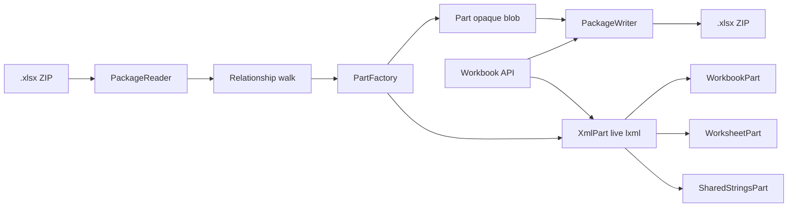

# How `xlsxedit` works

Choosing a library? See [Why xlsxedit?](why-xlsxedit.md) first. API catalog: [features.md](features.md).

`xlsxedit` is a surgical `.xlsx` editor. It does **not** rebuild the workbook from a high-level model (the failure mode that makes tools like openpyxl drop formatting). It loads the OPC ZIP into parts, mutates only the XML it understands, and writes the package back so unrelated parts survive.

If you need Excel’s on-disk layout (sheets, shared strings, styles), read [excel-xlsx-structure.md](excel-xlsx-structure.md) first.

---

## 1. Design goal

| Goal | How |
|------|-----|
| Change cell text | Edit shared-string / inline-string XML |
| Keep cell look | Never strip `s` (style index) on `<c>` |
| Keep unknown Excel features | Leave unrecognized parts as opaque byte blobs |
| Simple workflow | `open` → mutate → `save` |

Public surface today:

```python
from xlsxedit import Workbook

wb = Workbook.create()
wb = Workbook.open("report.xlsx")
ws = wb["Sheet1"]
ws["A1"].value = "hello"
ws["A2"].value = 42
ws["A3"].apply_date_format()
ws.column_dimensions["C"].width = 20.0
ws.merge_cells("A1:C1")
ws["B1"].hyperlink.url = "https://xlsxedit.jonasruilong.com"
ws.add_image("logo.jpg", anchor="E2")
ws.add_chart("bar", anchor="G2", data_range="A1:B5", title="Sales")
ws.add_table("A1:C10", ["Item", "Price"])
ws.add_conditional_formatting("A2:A10", operator="greaterThan", formula="0")
wb.add_worksheet("Report")
wb.replace("old", "new")          # SAR convenience — calls base cell APIs
wb.replace("{n}", 888, value_type="number")
wb.save("report_out.xlsx")
```

---

## 1b. Creating documents (template model)

`Workbook.create()` does not generate OPC XML in Python. It opens a bundled minimal package and mutates it — the same load/save path as editing an existing file.

| Asset | Role |
|-------|------|
| `templates/default.xlsx` | Runtime: `Workbook.create()` opens this |
| `templates/default-xlsx-template/` | Maintainer source (unpack/edit/repack) |
| `scripts/repack_default.py` | Pack folder → `default.xlsx` |

The template is a valid minimal workbook: one empty sheet, styles, theme, empty shared-string table. See section 9 for feature status. Base APIs are implemented; SAR wraps them.

---

## 2. Architecture



| Layer | Role |
|-------|------|
| `Workbook` / `Worksheet` / `Cell` | Public API |
| `OpcPackage` | In-memory package + relationships |
| `Part` / `XmlPart` / `PartFactory` | Blob vs parsed XML |
| `PackageReader` / `PackageWriter` | ZIP ↔ parts |

### Load path

1. Open the ZIP (or an unpacked directory).
2. Read `[Content_Types].xml` and `/_rels/.rels`.
3. **Walk the relationship graph** from the package root (same idea as Word’s OPC model): follow each internal relationship, load that part, then follow *its* relationships, and so on.
4. For each part, `PartFactory` picks a class by content type:
   - workbook / worksheet / sharedStrings → `XmlPart` subclass (parsed to lxml)
   - **everything else** → base `Part` (keeps original bytes)
5. Wire relationship objects so `rId`s point at real part instances.
6. `Workbook` wraps the workbook part, builds sheet proxies, and attaches the shared string table if present.

### Save path

1. Collect all loaded parts.
2. Regenerate `[Content_Types].xml` and each part’s `.rels` from the in-memory graph.
3. Write every part’s `blob`:
   - opaque `Part` → original bytes unchanged
   - `XmlPart` → re-serialize the live lxml tree
4. Produce a new ZIP.

---

## 3. What the library understands today

Only these content types are registered as live XML:

| Content type | Class | Edited for `replace`? |
|--------------|-------|------------------------|
| workbook (`.xlsx` / `.xlsm` / `.xltx` / `.xltm` variants) | `WorkbookPart` | No (read for sheet list) |
| worksheet | `WorksheetPart` | Read cells; inlineStr may be edited |
| sharedStrings | `SharedStringsPart` | Yes — `<t>` text mutated in place |
| styles | `StylesPart` | Live element; serves original bytes until a style is mutated |
| core properties (`docProps/core.xml`) | `CorePropertiesPart` | Via `wb.properties` |

Everything else (theme, drawings, charts, pivot caches, VBA, slicers, customXml, printer settings, …) falls through to opaque `Part`.

So for a text-only replace:

- `styles.xml` and `theme/theme1.xml` typically round-trip **byte-identical** (`StylesPart` keeps the original blob until you change a style).
- Sheet XML is re-serialized if loaded as `XmlPart`, even when you only changed the SST (attribute order / insignificant whitespace can change; structure and `s` on cells stay unless you edit them).
- Shared strings XML is re-serialized with your text changes.

---

## 4. How `replace` works

1. Walk each sheet’s `<c>` cells in `sheetData`.
2. Skip formula cells (`<f>` present) and non-string types (numbers, bools, errors).
3. For `t="s"`: read SST index from `<v>`, edit that `<si>` **once** per index (workbook-wide; Sheet1 and Sheet2 share the table).
4. For `t="inlineStr"`: edit `<t>` nodes under `<is>`.
5. Rich text: replace only when `old` sits entirely inside one `<t>` (run-local). Cross-run matches are skipped so `<rPr>` next door stays intact.
6. Do not rebuild or dedupe the SST; indices on cells stay valid.

That is why formatting survives: style indexes and property XML are left alone.

---

## 5. Unknown / new Excel features — are they kept?

**Short answer:** Yes for normal Office parts that are linked into the package through relationships — even if this library has never heard of them. They are loaded as opaque blobs and written back unchanged.

### What is preserved

| Situation | Behavior |
|-----------|----------|
| Chart, drawing, image, pivot cache, VBA, slicer, timeline, custom XML part, future Microsoft part | Loaded via the relationship graph → opaque `Part` → **same bytes on save** |
| New content type you have never registered | Same — default is opaque `Part` |
| Relationships pointing at those parts | Re-emitted on save from the in-memory graph |
| Cell style indexes (`s`), column widths, merged-region XML inside a sheet | Left alone by `replace` (sheet may still be re-serialized as XML) |

**Politeness:** do not interpret what you do not understand; do not drop it from the package.

Example flow for a chart:

```text
workbook.xml.rels → worksheets/sheet1.xml
sheet1.xml.rels     → drawings/drawing1.xml
drawing1.xml.rels   → charts/chart1.xml  (+ maybe media/image1.png)

None of those content types are registered → each is Part(blob=original)
save → all those blobs written again
```

You never parse the chart XML, so you cannot corrupt it by misunderstanding it.

### Important caveats (honest limits)

1. **Relationship-unreachable ZIP members are “orphans.”**  
   OPC is a graph, not “every ZIP member.” Related unknown features (charts, VBA, …) are always kept. Members with **no** relationship chain are still **discovered** on open as `Workbook.orphan_partnames`, but they are only written on save when you pass `include_orphans=True`. Default `save()` stays OPC-strict and omits them.

```python
wb = Workbook.open("report.xlsx")
if wb.orphan_partnames:
    print("unrelated ZIP cargo:", wb.orphan_partnames)
wb.save("out.xlsx", include_orphans=True)  # keep that cargo
```

2. **XML parts we *do* understand are re-serialized.**  
   Workbook, worksheets, and sharedStrings may change whitespace, attribute order, or namespace prefixes even when you only change one string. Semantic content for unedited nodes should remain; byte-identity is **not** promised for those parts.

3. **Package bookkeeping is regenerated.**  
   `[Content_Types].xml` and `.rels` items are rebuilt from the loaded graph. Targets and types are preserved; exact original XML formatting of those bookkeeping files is not. Orphans included via `include_orphans=True` get content-type entries when written.

4. **We do not implement every Excel behavior.**  
   Unknown features are preserved as cargo, not edited. `replace` will not search text inside charts, text boxes, headers as drawing text, or pivot caches — only worksheet string cells / SST / inlineStr as documented.

5. **Macros / binary parts**  
   If present and related (e.g. `vbaProject.bin`), they round-trip as blobs. The library does not inspect or resign them.

### Practical checklist

After open → replace → save on a “fancy” workbook:

| Expect kept | Expect maybe re-serialized | Expect ignored by replace |
|-------------|----------------------------|---------------------------|
| Charts, images, theme, styles (byte-identical unless mutated) | `sharedStrings.xml`, worksheets, workbook | Chart titles, comments UI drawing text*, pivots |
| VBA / customXml / slicers (as blob) | `[Content_Types].xml`, `.rels` | Non-string cell values |
| Orphan ZIP members | only if `include_orphans=True` | never edited |

\*Comments and some UI text live in other parts; v1 does not target them.

---

## 6. Mental model vs openpyxl

| | `xlsxedit` | openpyxl-style |
|--|---------------|----------------|
| Source of truth | Live package XML / blobs | Python object model |
| Unknown feature | Opaque part round-trips | Often dropped when writing a model that does not know it |
| Change one string | Touch SST (and maybe serialize sheet shells) | May rewrite styles / sheets heavily |
| Goal | Preserve on-disk fidelity while editing text | Rich authoring API |

Neither approach is “byte-identical ZIP.” The promise here is **semantic preservation of parts we do not edit**, especially unknown ones on the relationship graph.

---

## 7. Code map

| Path | Responsibility |
|------|----------------|
| `workbook.py` | `Workbook.open` / `create` / `save` / SAR / sheet lifecycle |
| `worksheet.py` | `ws[address]`, dimensions, merges, images/charts/tables |
| `cell.py` | Typed `value`, `formula`, `hyperlink`, style writes |
| `dimensions.py` | Column/row width and height |
| `styles.py` | Read/write `cellXfs` (clone xf, number formats) |
| `merge.py` | Merge range parsing and anchor map |
| `hyperlinks.py` | Cell hyperlink get/set |
| `conditional_formatting.py` | CF list and `cellIs` add |
| `drawing.py` | `Picture`, `Chart`, `Table` proxies |
| `shared_strings.py` | SST display text + in-place `<t>` replace |
| `parts.py` | Registers workbook / worksheet / SST part types |
| `opc/package.py` | Load/save orchestration |
| `opc/pkgreader.py` | Relationship-graph walk |
| `opc/pkgwriter.py` | ZIP write + content types |
| `opc/part.py` | Opaque `Part` vs `XmlPart` |

---

## 8. Extending safely later

To support a new feature **without** losing round-trip safety:

1. Prefer leaving it opaque until you must edit it.
2. When you need to edit it, register a new `XmlPart` subclass for that content type only.
3. Mutate the smallest nodes possible; keep sibling XML intact.
4. Add tests that open a fixture containing that feature, `replace` something unrelated, save, and assert the feature part’s bytes (or critical XML) still match.

Until then, unknown = blob = kept (if it was in the relationship graph).

---

## 9. Roadmap status

| Phase | Status | Features |
|-------|--------|----------|
| 1 — Create | done | `Workbook.create()`, `default.xlsx` template |
| 2 — Cells | done | `ws["B2"]`, typed `value`, `formula`, `cell.clear()` |
| 3 — Sheets | done | `add_worksheet`, `rename_worksheet`, `remove_worksheet` |
| 4 — Styles & layout | done | `cell.style` read, `apply_date_format`, `apply_number_format`, column/row dimensions, `merge_cells` |
| 5 — Images | done | `add_image`, `Picture` geometry, `replace_image`, `insert_image_at_placeholder` |
| 6 — Features | partial | Hyperlinks, CF read/add (`cellIs`), chart add/title, table add/resize; pivots/comments future |
| SAR | done | `replace`, typed replace (delegates to cell APIs), image SAR |

**Architecture rule:** new SAR helpers must call base methods first (e.g. `replace(..., value_type="date")` → `cell.value` + `apply_date_format()`).
